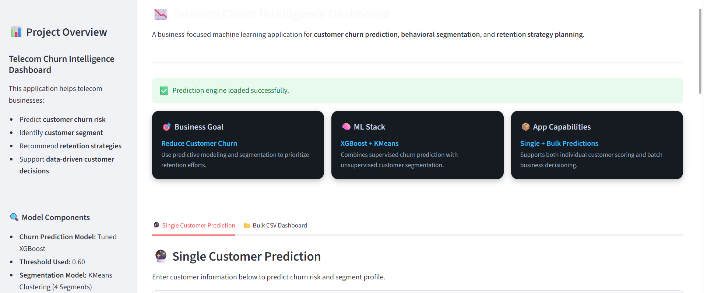
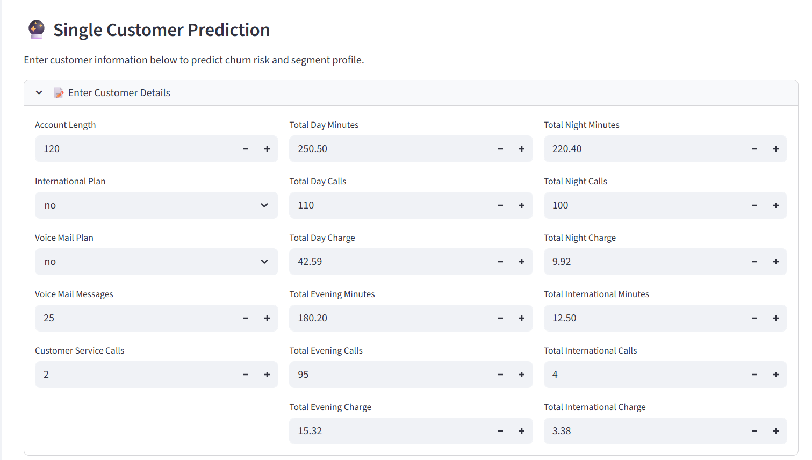
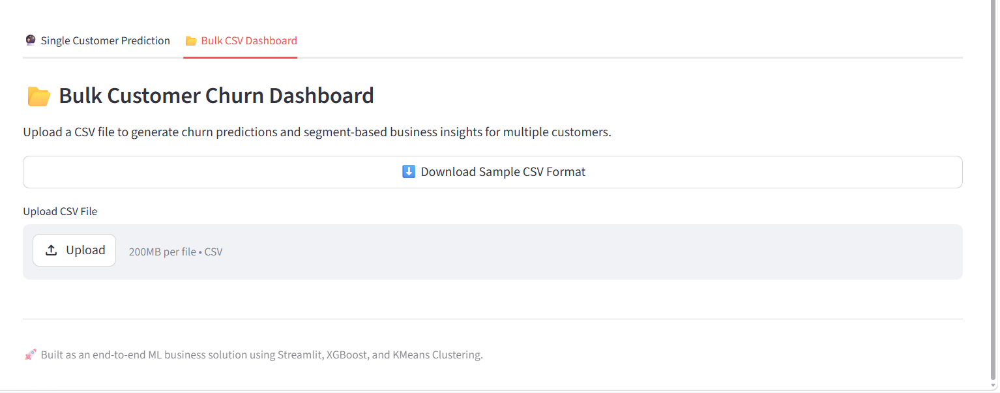

# 📉 Telecom Churn Prediction & Customer Segmentation

An end-to-end **machine learning + business intelligence** project designed to help telecom companies identify customers at risk of churn, understand behavioral customer segments, and recommend targeted retention strategies.

This project goes beyond a standard churn classifier by combining:

- **Supervised Learning** → to predict churn probability  
- **Unsupervised Learning** → to segment customers into meaningful business groups  
- **Threshold Optimization** → to support real-world decision-making  
- **Streamlit Deployment Layer** → to make the solution interactive and business-consumable  

---

## 🚀 Project Objective

Customer churn is one of the most important business problems in the telecom industry.

The goal of this project is to build a practical ML solution that can help telecom businesses:

- Predict which customers are likely to churn
- Quantify churn risk using churn probability
- Segment customers based on usage and service behavior
- Recommend retention actions for high-risk customers
- Enable both **single-customer** and **bulk customer scoring**

---

## 🌐 Live Demo

🚀 Try the deployed app here:  
👉 https://customer-churn-prediction-and-segmentation.streamlit.app/
⚠️ Note: The app may take a few seconds to load initially due to inactivity (free hosting behavior).

## 🧠 Business Problem

Telecom companies often lose customers due to:

- poor customer service experience
- high service issue frequency
- poor pricing/value perception
- low engagement or plan mismatch
- dissatisfaction among high-value or international users

A churn model alone is useful — but incomplete.

This project improves business usability by combining **churn prediction + customer segmentation**, allowing teams to answer:

> **"Which customers are likely to churn, and what type of customer are they?"**

That makes retention strategy much more actionable.

---

## 📌 Key Features

### ✅ Churn Prediction
Predicts whether a customer is likely to churn using a tuned **XGBoost classifier**.

### ✅ Churn Probability
Returns customer-level churn probability instead of just binary output.

### ✅ Threshold Tuning
Business decision threshold optimized and fixed at **0.60** instead of relying on default 0.50.

### ✅ Customer Segmentation
Uses **KMeans clustering** to classify customers into 4 business-relevant segments.

### ✅ Segment-Based Strategy
Each segment is mapped to business-friendly customer personas and retention strategies.

### ✅ Streamlit App
Interactive app supports:

- Single customer prediction
- Bulk CSV upload
- Risk categorization
- Segment identification
- Retention recommendations
- Downloadable prediction output

---

## 🛠️ Tech Stack

### Languages & Libraries
- **Python**
- **Pandas**
- **NumPy**
- **Matplotlib**
- **Seaborn**
- **Scikit-learn**
- **XGBoost**
- **Joblib**
- **Streamlit**

### ML Techniques Used
- Feature Engineering
- Data Preprocessing
- Feature Selection
- Supervised Learning
- Hyperparameter Tuning
- Threshold Optimization
- KMeans Clustering
- Business-Oriented Model Interpretation

---

## 📂 Project Structure

```bash
Customer-Churn-Prediction-and-Segmentation/
│
├── artifacts/
│   ├── best_xgb_model.pkl
│   ├── final_feature_columns.pkl
│   ├── config.json
│   ├── kmeans_model.pkl
│   ├── cluster_scaler.pkl
│   ├── cluster_feature_columns.pkl
│   ├── segment_mapping.json
│   
├── assets/
│   ├── app_home.png
│   ├── app_home_2.png
│   ├── bulk_prediction_dashboard.png
│   ├── single_prediction_dashboard.png
│   ├── Single_Prediction_results.png
│
├── data/raw
│   └── telecom_churn.csv
│
├── notebooks/
│   ├── 01_eda.ipynb
│   ├── 02_feature_engineering_and_preprocessing.ipynb
│   ├── 03_feature_selection_and_model_training.ipynb
│   ├── 04_clustering_and_customer_segmentation.ipynb
│   ├── 05_threshold_tuning.ipynb
│   ├── 06_business_insights.ipynb
│
├── model_graphs/
│   ├── Best_confusion_matrix.png
│   ├── Best_roc_curve.png
│   ├── Logistic_Regression_confusion_matrix.png
│   ├── Logistic_Regression_roc_curve.png
│   ├── Random_Forest_confusion_matrix.png
│   ├── Random_Forest_roc_curve.png
│   ├── Xgboost_confusion_matrix.png
│   ├── Xgboost_roc_curve.png
│
├── models/
│   ├── best_model.pkl
│   ├── logistic_regression_model.pkl
│   ├── random_forest_model.pkl
│   ├── xgboost_model.pkl
│
├── src/
│   ├── data_loader.py
│   ├── feature_engineering.py
│   ├── data_preprocessing.py
│   ├── feature_selection.py
│   ├── clustering.py
│   ├── train_models.py
│   ├── evaluate_models.py
│   ├── threshold_tuning.py
│   ├── predict.py
│   ├── segment_predict.py
|
├── app.py
├── main.py
├── requirements.txt
├── README.md
├── .gitignore
```

---

## ⚙️ End-to-End ML Pipeline

The project was built with a modular production-style workflow.

### 1. Data Loading
Raw telecom customer dataset is loaded from the `data/` folder.

### 2. Feature Engineering
Created business-relevant features such as:

- `total_charges`
- `total_usage`
- `total_calls`
- `avg_call_duration`
- `day_usage_share`
- `intl_usage_share`
- `service_calls_per_month_proxy`
- `high_service_issue_flag`
- `intl_mins_per_call`

### 3. Data Preprocessing
Applied preprocessing transformations required before modeling.

### 4. Feature Selection
Selected final feature set for churn modeling (**Feature Set B** chosen as final production feature set).

### 5. Customer Segmentation
Used selected behavioral features to group customers into meaningful clusters.

### 6. Model Training
Trained and compared multiple ML models:

- Logistic Regression
- Random Forest
- XGBoost

### 7. Hyperparameter Tuning
Optimized model performance using tuned XGBoost.

### 8. Model Evaluation
Compared models using:

- Accuracy
- Precision
- Recall
- F1 Score
- ROC-AUC

### 9. Threshold Tuning
Selected **0.60** as final business threshold for churn decisioning.

### 10. Deployment Layer
Packaged final inference logic into:

- `predict.py` → churn inference
- `segment_predict.py` → customer segment inference
- `app.py` → Streamlit business app

---

## 🤖 Model Development Summary

### Models Evaluated
- Logistic Regression
- Random Forest
- XGBoost

### Final Selected Model
✅ **Tuned XGBoost**

### Why XGBoost was selected
XGBoost provided the best balance of:

- predictive performance
- churn class detection
- business usability
- probability-based scoring

---

## 🎯 Threshold Tuning Strategy

Instead of using the default classification threshold of **0.50**, this project uses a **business-optimized threshold of 0.60**.

### Why threshold tuning matters:
In churn prediction, business teams often care more about:

- identifying meaningful churners
- reducing false alarms
- improving retention targeting efficiency

Using **0.60** helped improve decision quality for deployment-oriented use cases.

---

## 🧩 Customer Segmentation Strategy

A separate **KMeans clustering model** was used to segment customers based on behavioral and service-related features.

### Clustering Features Used
- `total_charges`
- `total_usage`
- `total_calls`
- `avg_call_duration`
- `day_usage_share`
- `eve_usage_share`
- `night_usage_share`
- `intl_usage_share`
- `number_customer_service_calls`
- `service_calls_per_month_proxy`
- `total_intl_minutes`
- `intl_mins_per_call`

### Final Number of Segments
✅ **4 customer segments**

### Business Segment Labels
- **High-Value Heavy Usage Customers**
- **Routine Low-Engagement Customers**
- **International-Focused Budget Customers**
- **Service-Sensitive Support-Heavy Customers**

These labels were created to make the output more useful for business interpretation and retention planning.

---

## 💡 Business Value of the Solution

This project is designed not just as a machine learning model, but as a **decision-support system**.

### It helps businesses:
- prioritize high-risk customers
- personalize retention strategies
- understand which customer groups are most vulnerable
- combine prediction with segmentation for smarter action

### Example Output Includes:
- churn probability
- churn prediction
- risk level
- cluster ID
- customer segment
- retention action
- segment strategy

---

## 🖥️ Streamlit App Features

The deployed app supports:

### 🔮 Single Customer Prediction
Users can manually enter customer details and get:

- churn probability
- churn prediction
- risk level
- customer segment
- recommended action

### 📂 Bulk CSV Prediction
Users can upload a CSV file and get:

- batch churn predictions
- segment assignments
- risk distribution
- segment distribution
- downloadable output

### 📊 Business Dashboard Experience
Includes:

- KPI cards
- prediction summary
- risk distribution chart
- segment distribution chart
- high-risk customer table
- CSV download option

---

## 📈 Example Business Use Cases

This solution can be used by:

- **Customer Retention Teams** → prioritize outreach
- **CRM Teams** → personalize campaigns
- **Operations Teams** → identify service-sensitive users
- **Business Analysts** → understand churn trends
- **Product/Strategy Teams** → evaluate customer behavior patterns

---

## ▶️ How to Run the Project

### 1. Clone the Repository

```bash
git clone https://github.com/your-username/Customer-Churn-Prediction-and-Segmentation.git
cd Customer-Churn-Prediction-and-Segmentation
```

### 2. Install Dependencies

```bash
pip install -r requirements.txt
```

### 3. Run the Full ML Pipeline

```bash
python main.py
```

### 4. Run the Streamlit App

```bash
streamlit run app.py
```

---

## 📊 Future Improvements

Potential enhancements for future iterations:

- model monitoring and drift detection
- SHAP-based explainability
- cloud deployment (Azure / Streamlit Cloud)
- API deployment using FastAPI
- automated retraining pipeline
- experiment tracking with MLflow

---

## 📌 Key Learnings from This Project

This project helped strengthen my understanding of:

- end-to-end ML pipeline design
- business-focused feature engineering
- churn modeling and threshold tuning
- clustering for customer intelligence
- modular production-style Python code
- deployment-oriented ML thinking
- building interactive ML apps with Streamlit

---

## 🙋 About Me

I am building hands-on projects in:

- Data Science
- Machine Learning
- Business Analytics
- Customer Intelligence
- Predictive Modeling

This project reflects my effort to build **practical, business-relevant ML systems** rather than just notebook-based models.

---
## 📸 App Screenshots

### Dashboard Home


### Single Customer Prediction


### Bulk Prediction Dashboard


## ⭐ If You Found This Interesting

If you found this project useful or interesting, feel free to:

- star the repository
- connect with me on LinkedIn
- explore my other ML/Data Science projects

---

A sample input file is available at:

data/sample_customers.csv
